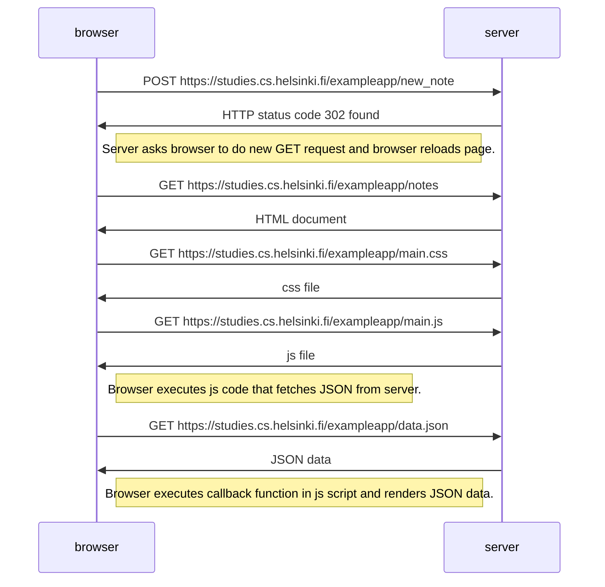

```mermaid
sequenceDiagram 
    browser->>server: POST https://studies.cs.helsinki.fi/exampleapp/new_note
    server->>browser: HTTP status code 302 found
    Note right of browser: Server asks browser to do new GET request and browser reloads page.
    browser->>server: GET https://studies.cs.helsinki.fi/exampleapp/notes
    server->>browser: HTML document
    browser->>server: GET https://studies.cs.helsinki.fi/exampleapp/main.css
    server->>browser: css file
    browser->>server: GET https://studies.cs.helsinki.fi/exampleapp/main.js
    server->>browser: js file
    Note right of browser: Browser executes js code that fetches JSON from server.
    browser->>server: GET https://studies.cs.helsinki.fi/exampleapp/data.json
    server->>browser: JSON data
    Note right of browser: Browser executes callback function in js script and renders JSON data.
```