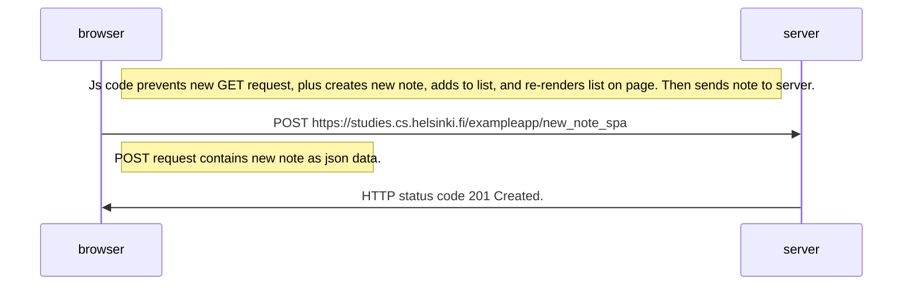

```mermaid
sequenceDiagram
    participant browser
    participant server

    Note right of browser: Js code prevents new GET request, plus creates new note, adds to list, and re-renders list on page. Then sends note to server.

    browser->>server: POST https://studies.cs.helsinki.fi/exampleapp/new_note_spa
    Note right of browser: POST request contains new note as json data. 
    server->>browser: HTTP status code 201 Created.
```